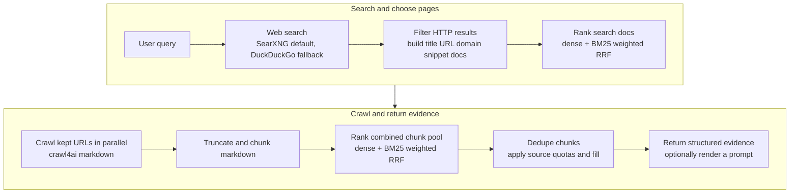

# TinySearch

<p align="center">
  <a href="https://tinysuite.dev">
    
  </a>
</p>

[](https://tinysuite.dev)
[](LICENSE)
[](https://github.com/MarcellM01/TinySearch/releases)
[](https://github.com/MarcellM01/TinySearch/commits/main)
[](https://hub.docker.com/r/marcellm01/tinysearch)
[](https://discord.gg/NG6u2zamR)


**Self-hosted web research for MCP agents.**

TinySearch gives local AI agents a web-research tool they can actually use:
search the web, rerank results, crawl the best pages, and return structured,
source-grounded evidence that can optionally be rendered as an LLM prompt.

<p align="center">
  
</p>

No hosted dashboard. No account system. No analytics. No scraped-data cache.

Just search -> crawl -> rerank -> structured evidence.

## Contents

- [Why people use it](#why-people-use-it)
- [Python library](#python-library)
- [Quick start](#quick-start)
- [How it works](#how-it-works)
- [Run from source](#run-from-source)
- [Docker](#docker)
- [Optional HTTP server](#optional-http-server)
- [Configuration](#configuration)
- [Search backends](#search-backends)
- [When not to use TinySearch](#when-not-to-use-tinysearch)
- [TinySearch vs...](#tinysearch-vs)
- [Community](#community)
- [Entrypoints](#entrypoints)
- [Tests](#tests)
- [Contact](#contact)
- [Privacy notes](#privacy-notes)
- [License](#license)

## Why people use it

- Add web research to Cursor, Cline, Roo Code, Claude Desktop, or any MCP client.
- Keep source URLs attached to the evidence your model sees.
- Avoid dumping full webpages into context.
- Run with local ONNX embeddings by default, or bring an OpenAI-compatible embedding API.
- Use SearXNG by default, with a DuckDuckGo HTML fallback when configured.
- Keep the stack small enough to run locally in Docker.

TinySearch is built for local agents, prototypes, personal workflows, and small
systems where source-grounded web research matters more than running a full
search product.

## Python library

Install the core package without server dependencies:

```bash
pip install tinysuite-tinysearch
```

Retrieval returns a stable, JSON-serializable evidence result:

```python
import asyncio
from tinysearch import TinySearchConfig, research, to_prompt

async def main():
    result = await research(
        "How does asyncio cancellation work?",
        config=TinySearchConfig(search_top_k=10),
    )
    print(result["sources"])

    # Render the same evidence for an LLM only when needed.
    print(to_prompt(result))

asyncio.run(main())
```

Library calls use canonical DDGS defaults and do not implicitly read
environment variables, the current directory, or a repository config file.
Pass a `TinySearchConfig`, partial dictionary, or explicitly loaded JSON config
when you want overrides.

Migration from the prompt-first Python API:

```python
# Before
prompt = (await research(query))["answer"]

# After
result = await research(query)
prompt = to_prompt(result)
```

Install the optional MCP and HTTP transports with:

```bash
pip install "tinysuite-tinysearch[server]"
```

## Quick start

Run TinySearch with its own SearXNG instance as an MCP server over Streamable
HTTP. Docker Compose loads the configuration directly from GitHub, so you do
not need to clone the repository or create any configuration files:

```bash
docker compose -f "https://github.com/MarcellM01/TinySearch.git#main:compose.quickstart.yaml" up -d
```

Then connect your MCP client to:

```json
{
  "mcpServers": {
    "tinysearch": {
      "url": "http://localhost:8000/mcp"
    }
  }
}
```

Stop and remove the containers later with:

```bash
docker compose -f "https://github.com/MarcellM01/TinySearch.git#main:compose.quickstart.yaml" down
```

TinySearch exposes three MCP tools:

```text
get_current_datetime()
research(query)
scrape_url(url, query)
```

Typical routing:

- Use `research(query)` when the agent needs to discover relevant URLs.
- Use `scrape_url(url, query)` when the user already provided a URL, or when
  `research` found the page to inspect.
- Use `get_current_datetime()` before time-sensitive research.

The tools return a grounded prompt in the `answer` field by default. Pass
`output_format: "json"` to receive the schema-v1 structured evidence instead.

## How it works



TinySearch does not directly answer the question. The core returns structured
evidence; MCP renders that evidence into the **`answer` field** by default, and
your **client model** produces the final **cited response**.

<p align="center">
  
</p>

## Run from source

Use this path if you want to inspect the code, edit TinySearch, or run it as a
local stdio MCP server.

```bash
git clone https://github.com/MarcellM01/TinySearch
cd TinySearch

python -m venv .venv
source .venv/bin/activate
pip install -e ".[server]"
```

MCP clients spawn TinySearch from their config. Add it with absolute paths:

macOS / Linux:

```json
{
  "mcpServers": {
    "tinysearch": {
      "command": "/absolute/path/to/TinySearch/.venv/bin/python",
      "args": [
        "/absolute/path/to/TinySearch/servers/mcp_server.py"
      ]
    }
  }
}
```

Windows:

```json
{
  "mcpServers": {
    "tinysearch": {
      "command": "C:/absolute/path/to/TinySearch/.venv/Scripts/python.exe",
      "args": [
        "C:/absolute/path/to/TinySearch/servers/mcp_server.py"
      ]
    }
  }
}
```

Template config files live in `mcp_templates/`.

The repo also includes [`agentic_coding_templates/global-rules-recommended.md`](agentic_coding_templates/global-rules-recommended.md),
a global-rules template for agentic coding tools such as Cline and Roo Code.
These rules help coding agents call TinySearch only when web research is
actually needed.

The server uses **stdio** by default, which is what Cursor and similar clients
expect when they spawn `python .../mcp_server.py`. To run with `sse` or
`streamable-http`, set `MCP_TRANSPORT` when starting the process. Do not put
transport in `configs/research_config.json`.

## Docker

The [quick start](#quick-start) command runs TinySearch over Streamable HTTP on
`http://localhost:8000/mcp`. Docker pulls `marcellm01/tinysearch:latest`
automatically if the image is not already local.

With `MCP_TRANSPORT=streamable-http`, the image serves Streamable HTTP on
`/mcp` and SSE on `/mcp/sse`. GET requests to `/mcp` without an
`mcp-session-id` are treated as the legacy SSE stream. If a client still cannot
connect, try `MCP_TRANSPORT=sse` alone or the stdio Docker setup below.

### Docker image tags

Docker images are published automatically when a version tag or GitHub release is created.

- `marcellm01/tinysearch:<version>` is published for tags such as `v0.1.4`.
- `marcellm01/tinysearch:latest` is updated for stable releases.
- Images are built for both `linux/amd64` and `linux/arm64`.

### Persistent models and config

For repeated use, keep downloaded models in a Docker volume and mount your local
config. The mounted config can also include `blocked_domains` to exclude sites
from search results:

```bash
docker run --rm \
  -p 8000:8000 \
  -v tinysearch-models:/data/models \
  -v "$PWD/configs/research_config.json:/config/research_config.json:ro" \
  -e TINYSEARCH_CONFIG_PATH=/config/research_config.json \
  -e MCP_TRANSPORT=streamable-http \
  -e MCP_HOST=0.0.0.0 \
  marcellm01/tinysearch:latest
```

Example config entry:

```json
"blocked_domains": ["example.com", "spammy-site.test"]
```

### MCP over stdio

Use this mode for MCP clients that launch tools as local commands instead of
connecting to a URL. Replace `/absolute/path/to/TinySearch` with this repo's
absolute path:

```json
{
  "mcpServers": {
    "tinysearch": {
      "command": "docker",
      "args": [
        "run",
        "--rm",
        "-i",
        "-v",
        "tinysearch-models:/data/models",
        "-v",
        "/absolute/path/to/TinySearch/configs/research_config.json:/config/research_config.json:ro",
        "-e",
        "TINYSEARCH_CONFIG_PATH=/config/research_config.json",
        "-e",
        "TINYSEARCH_MODELS_DIR=/data/models",
        "marcellm01/tinysearch:latest"
      ]
    }
  }
}
```

Edit `configs/research_config.json` to choose `embedding_model` (`fast`,
`balanced`, `quality`, or a custom Hugging Face ONNX repo id). The named Docker
volume keeps downloaded model bundles between launches.

## Optional HTTP server

Useful when you want HTTP instead of MCP:

Install `tinysuite-tinysearch[server]`, then run:

```bash
uvicorn tinysearch.servers.fastapi_server:app --reload
```

Endpoints mirror the MCP tools:

- `GET /health`
- `GET /current_datetime`
- `POST /research` — `{"query": "...", "output_format": "prompt"}`
- `POST /scrape` — `{"url": "...", "query": "...", "output_format": "prompt"}`

`output_format` accepts `prompt` (the compatibility default) or `json`.
JSON mode returns the same schema-v1 evidence as the Python API.

Errors return `{"detail": {"code", "message"}}` with stable codes:
`invalid_url` (400), `blocked_url` (403), `unsupported_document` (415),
`empty_content` (422), `fetch_failed` (502), `fetch_timeout` (504).

### URL safety

`/scrape` and `scrape_url` accept arbitrary user-supplied URLs and enforce
the following checks before fetching:

- only `http` and `https` schemes
- URLs with embedded credentials are rejected
- IP literals and resolved addresses that are loopback, private, link-local,
  multicast, reserved or unspecified are rejected (DNS rebinding is mitigated
  by rejecting if **any** resolved address is non-public, not just one)
- the configured `blocked_domains` list is applied to both the initial URL
  and the final URL reported by the crawler after redirects

Crawl4AI does not expose intermediate redirect hops, so the safety check runs
on the initial URL and the final URL. If you need stricter handling for
redirect chains, run TinySearch behind an egress proxy that enforces your
policy.

## Configuration

The Python API owns one canonical default configuration and accepts explicit
configuration objects or dictionaries. Server processes additionally support
`TINYSEARCH_CONFIG_PATH`; `SEARXNG_URL` and `TINYSEARCH_SEARCH_BACKEND` are
server/deployment overrides. Precedence is CLI/runtime overrides, environment,
the explicit server config file, then core defaults.

`configs/research_config.json` is the partial SearXNG Compose profile, not a
package default.

Set `blocked_domains` to a JSON list of domains you do not want TinySearch to
return or crawl. Entries match the domain and its subdomains, so `example.com`
also blocks `www.example.com` and `news.example.com`. URL-style entries such as
`https://example.com/path` are accepted and normalized to their hostname.

The `onnx` embedding backend uses local ONNX bundles under `models/`. Starting
the MCP server or FastAPI app downloads the configured `embedding_model` once
from Hugging Face when `embedding_backend` is `onnx`.

Built-in local presets:

- `fast`: `onnx-models/all-MiniLM-L6-v2-onnx`
- `balanced`: `BAAI/bge-small-en-v1.5`
- `quality`: `BAAI/bge-base-en-v1.5`

You can also set `embedding_model` to a custom Hugging Face ONNX repo id. Set
`TINYSEARCH_MODELS_DIR` to move the model cache, or use
`TINYSEARCH_ONNX_MODEL_DIR` when you need to point at one exact bundle directory.

Key settings:

- Search: `search_top_k`, `search_rrf_cutoff`, `search_dense_weight`, `search_max_results_to_keep`, `blocked_domains`
- Search backend: `search_backend`, `search_backend_url`, `search_engines`, `search_region`, `search_backend_fallback`, `ddgs_backend`, `ddgs_timeout_seconds`
- Chunks: `chunk_rrf_cutoff`, `chunk_dense_weight`, `chunk_max_results_to_keep`
- Crawl: `crawl_max_chunk_tokens`, `crawl_overlap_tokens`, `max_concurrent_crawls`
- Embeddings: `embedding_backend`, `embedding_model`, `embedding_openai_env_file`, `max_concurrent_embedding_calls`
- Tokenizer: `encoding_name`
- Dense input prefixes: `dense_query_prefix`, `dense_document_prefix`
- Trace: `trace_path`

For `embedding_backend` `openai_compatible`, add a `.env` file at the project
root, or set `embedding_openai_env_file`, with:

```text
OPENAI_BASE_URL=
OPENAI_API_KEY=
OPENAI_EMBEDDING_MODEL=
```

`OPENAI_BASE_URL` is optional for api.openai.com. `EMBEDDING_MODEL` and
`MODEL_NAME` are accepted as aliases for `OPENAI_EMBEDDING_MODEL`.

The research pipeline requires dense embeddings. It raises if
`search_dense_weight` or `chunk_dense_weight` is set to `0`.

## Search backends

TinySearch supports multiple web-search backends and selects between them
from config.

Native (non-Docker) installs default to `search_backend: "ddgs"`, which uses
the [`ddgs`](https://pypi.org/project/ddgs/) package's automatic text-search
backend selection in-process — no SearXNG deployment required. The bundled
Docker Compose setup instead defaults to `search_backend: "searxng"`, with a
local SearXNG sidecar.

Available values for `search_backend`:

- `"ddgs"` (native default): query `ddgs`'s automatic backend selection
  directly. Tune it with `ddgs_backend` (defaults to `"auto"`) and
  `ddgs_timeout_seconds` (defaults to `20`).
- `"searxng"` (Docker default): query a SearXNG-compatible JSON endpoint. If
  the call fails and `search_backend_fallback` is `true`, TinySearch falls
  back to `ddgs` in DuckDuckGo compatibility mode. With
  `search_backend_fallback: false` the SearXNG error surfaces.
- `"duckduckgo"`: skip SearXNG entirely and query `ddgs` with
  `backend="duckduckgo"`. This is the escape hatch that preserves pre-0.4
  DuckDuckGo-only behavior (previously a hand-written HTML scraper, now
  DDGS-backed).
- `"auto"`: try SearXNG, then `ddgs` in DuckDuckGo compatibility mode on any
  backend failure (fallback is implied regardless of
  `search_backend_fallback`).

A backend "failure" means a real backend error: network/timeout, non-200 HTTP
response, a non-JSON SearXNG body, or a `ddgs` rate-limit/error response. A
legitimate empty result set is **not** a failure and does not trigger
fallback.

Minimal config example:

```json
{
  "search_backend": "ddgs",
  "ddgs_backend": "auto",
  "ddgs_timeout_seconds": 20,
  "search_region": "us-en"
}
```

### Brave keyed fallback

Set the `BRAVE_SEARCH_API_KEY` environment variable to enable Brave's
official Web Search API as a fallback for the `ddgs` and `duckduckgo`
backends. Brave is only ever consulted when the primary `ddgs` call errors or
returns no results, and only when the key is present — with no key, DDGS
failures and legitimate empty results propagate exactly as they would
otherwise. The key is read from the environment on every call; it is never
written to a config file, saved, or logged. Brave is not a selectable
`search_backend` value on its own, and `"searxng"`/`"auto"` never consult it.

### SearXNG JSON output is required

SearXNG ships with the JSON output format **disabled** by default. The bundled
`searxng/settings.yml` enables it via:

```yaml
search:
  formats:
    - html
    - json
```

If TinySearch reports `SearchBackendUnavailable: SearXNG did not return JSON`,
your SearXNG instance is returning HTML — add `json` to `search.formats` and
restart it.

### Environment overrides

- `SEARXNG_URL`: overrides `search_backend_url` for the running process. Useful
  in Docker so the same image can point at different SearXNG endpoints without
  rebuilding `research_config.json`.

### Compose setup

The bundled `compose.yaml` starts a `searxng` service alongside `tinysearch`
(and optionally `fastapi`). Both TinySearch services reach SearXNG at
`http://searxng:8080/search` over the internal compose network, and have
`SEARXNG_URL` set automatically.

```bash
docker compose up
```

A minimal `searxng/settings.yml` is committed at the repo root. Override
`server.secret_key` before exposing the SearXNG instance beyond localhost.

### Single-container / from-source

The Python library and standalone image use the canonical
`search_backend: "ddgs"` default with no SearXNG involvement. A checkout no
longer changes defaults merely because `configs/research_config.json` exists.
The bundled Compose setup explicitly loads that partial profile to select
SearXNG and its tuned retrieval limits.

To force DuckDuckGo-only behavior with no SearXNG involvement, set:

```json
{ "search_backend": "duckduckgo" }
```

## When not to use TinySearch

TinySearch is not a replacement for a commercial search API or a persistent
crawler. It is probably not the right tool if you need:

- guaranteed search coverage
- large-scale indexing
- long-term page caching
- enterprise observability
- production SLA-backed web search

## TinySearch vs...

| Option | Best when you want | Tradeoff |
| --- | --- | --- |
| Search API | Hosted search results with stronger coverage guarantees | Usually paid, hosted, and not MCP-native |
| SearXNG | Self-hosted metasearch | You still need crawling, reranking, chunking, and prompt assembly |
| Full crawler / index | Persistent searchable storage | More infrastructure than most local agents need |
| Browser automation | A model clicking around the web | More tokens, slower runs, and less predictable evidence packing |
| **TinySearch** | A local MCP research tool that returns ranked, cited evidence chunks | Lightweight by design; not a full search engine or hosted answer API |

## Community

Join the [TinySearch Discord](https://discord.gg/NG6u2zamR) for support,
release updates, bug reports, and contributor discussion.

## Entrypoints

- `tinysearch.research` and `tinysearch.scrape_url`: structured Python API
- `tinysearch.to_prompt`: pure structured-evidence prompt renderer
- `tinysearch mcp`: stdio MCP server (also the temporary no-argument default)
- `tinysearch serve`: Streamable HTTP MCP server
- `tinysearch.servers.fastapi_server:app`: optional FastAPI application

## Tests

Run the unittest suite:

```bash
python -m unittest discover tests
```

## Contact

Using TinySearch or want to build on it?

[Email me](mailto:hello.marcbuilds@gmail.com) or reach me on [Bluesky](https://bsky.app/profile/marcellm01.bsky.social).

## Privacy notes

TinySearch reads the pages it crawls and returns ranked excerpts to the calling
client. It does not include credentials in the repo, and `.env` / trace output
should stay local. If you enable `openai_compatible` embeddings, your embedding
provider receives the text snippets sent for vectorization.

## License

Source code in this repository is under the [MIT License](LICENSE).

When `embedding_backend` is `onnx`, TinySearch may download the selected local
ONNX embedding bundle at runtime from Hugging Face. Those weights are separate
distributions under their model-card licenses; keep license and attribution
notices if you ship or redistribute those files. Optional manual export for
`fast` uses `sentence-transformers/all-MiniLM-L6-v2` (Apache-2.0).

See [NOTICE](NOTICE) for Docker and third-party distribution notes.
