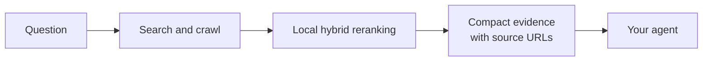

# TinySearch

<!-- mcp-name: io.github.MarcellM01/tinysearch -->

<p align="center">
  <a href="https://tinysuite.dev">
    
  </a>
</p>

<p align="center">
  <strong>Spend tokens on answers, not webpages.</strong>
</p>

<p align="center">
  TinySearch searches, crawls, and reranks the web locally, then gives your
  agent only the evidence worth putting in its context.
</p>

<p align="center">
  <a href="https://tinysuite.dev/docs/tinysearch/">Documentation</a>
  ·
  <a href="#quick-start">Quick start</a>
  ·
  <a href="#python-library">Python</a>
  ·
  <a href="https://discord.gg/NG6u2zamR">Discord</a>
</p>

[](https://tinysuite.dev)
[](https://pypi.org/project/tinysuite-search/)
[](LICENSE)
[](https://github.com/MarcellM01/TinySearch/releases)
[](https://github.com/MarcellM01/TinySearch/commits/main)
[](https://hub.docker.com/r/marcellm01/tinysearch)
[](https://discord.gg/NG6u2zamR)


## Contents

- [Choose a tier](#choose-a-tier)
- [The expensive part of agent research is context](#the-expensive-part-of-agent-research-is-context)
- [Quick start](#quick-start)
- [What your agent gets](#what-your-agent-gets)
- [Three focused tools](#three-focused-tools)
- [How it works](#how-it-works)
- [Python library](#python-library)
- [Search backends](#search-backends)
- [Why TinySearch](#why-tinysearch)
- [Part of TinySuite](#part-of-tinysuite)
- [Documentation](#documentation)
- [When not to use TinySearch](#when-not-to-use-tinysearch)
- [Development](#development)
- [Entrypoints](#entrypoints)
- [Community](#community)
- [Privacy and license](#privacy-and-license)

TinySearch is a self-hosted web-research tool for AI agents. It searches the
web, reads the best pages, removes low-value content, and returns compact
evidence with source URLs.

Your model receives the useful passages instead of paying to process entire
webpages.

TinySearch is part of [TinySuite](https://tinysuite.dev), a suite of focused
tools designed to make agentic operations cheaper by minimizing token usage
through smart retrieval, selection, and context-management techniques.

<p align="center">
  
</p>

## Choose a tier

| Tier | Use it when | Entry point | Search backend |
| --- | --- | --- | --- |
| 1. Python library | You are building with TinySuite or Python | `pip install tinysuite-search` | DDGS |
| 2. One-command MCP | An MCP client should launch TinySearch for you | `uvx --from "tinysuite-search[server]" tinysearch` | DDGS |
| 3. Docker + SearXNG | You want the full self-hosted stack and HTTP MCP | `docker compose ... up -d` | Bundled SearXNG |

Tiers 1 and 2 need no search service. Tier 3 adds a dedicated SearXNG service,
persistent model storage, and a network MCP endpoint. See the
[installation guide](https://tinysuite.dev/docs/tinysearch/) for the Docker
setup.

## The expensive part of agent research is context

A search result is not yet useful evidence. Agents often have to open several
pages, ingest navigation and boilerplate, and spend paid input tokens deciding
which passages matter.

TinySearch moves that work in front of the model:



That lowers cost in three ways:

- **Smaller model context.** Only the best-ranked evidence chunks are returned,
  within a controlled evidence budget.
- **No metered search API required by default.** TinySearch can search through
  DDGS without a paid search provider.
- **Local retrieval by default.** ONNX embeddings and hybrid reranking run on
  your machine instead of creating embedding API charges.

Search broadly. Read locally. Pay the model only for the evidence that matters.

Actual savings depend on the pages, evidence limits, client model, and provider
pricing. TinySearch reduces the web content sent to the model; it does not
control what the client does with that evidence afterward.

## Quick start

With [`uv`](https://docs.astral.sh/uv/) installed, add TinySearch to any MCP
client:

```json
{
  "mcpServers": {
    "tinysearch": {
      "command": "uvx",
      "args": [
        "--from",
        "tinysuite-search[server]",
        "tinysearch"
      ]
    }
  }
}
```

The client launches TinySearch over stdio when it needs it. No repository
clone, hosted account, or paid search key is required.

On first launch, TinySearch installs Chromium and downloads the local
embedding model before it starts accepting requests — a one-time delay of a
minute or two. To avoid that delay on the first real query, pre-warm both
ahead of time:

```bash
uvx --from "tinysuite-search[server]" tinysearch setup
```

Prefer Docker, a remote MCP endpoint, or a source checkout? Follow the
[installation guide](https://tinysuite.dev/docs/tinysearch/).

## What your agent gets

TinySearch does not spend another model call writing the final answer. It gives
your existing agent ranked, source-grounded evidence to reason over.

An abridged structured result looks like this:

```json
{
  "schema_version": "1",
  "operation": "research",
  "status": "ok",
  "query": "How does asyncio cancellation work?",
  "sources": [
    {
      "title": "Coroutines and Tasks",
      "url": "https://docs.python.org/3/library/asyncio-task.html",
      "chunks": [
        {
          "text": "Tasks can be cancelled...",
          "tokens": 146,
          "rank": 1,
          "scores": {
            "rrf": 0.91,
            "dense": 0.88,
            "bm25": 0.79
          }
        }
      ]
    }
  ],
  "stats": {
    "search_results": 10,
    "sources_crawled": 4,
    "chunks_considered": 86,
    "chunks_selected": 8
  }
}
```

MCP tools return the same evidence as a grounded prompt by default, ready for
the client model to use. Pass `output_format: "json"` when you want the
structured result directly.

## Three focused tools

| Tool | Use it when |
| --- | --- |
| `research(query)` | The agent needs to discover and compare relevant sources |
| `scrape_url(url, query)` | You already know which page should be inspected |
| `get_current_datetime()` | Research depends on the current date or time |

TinySearch deliberately stays focused. It is a retrieval layer, not another
agent, chat interface, hosted search product, or permanent web index.

See the complete [MCP tool reference](https://tinysuite.dev/docs/tinysearch/mcp-tools/)
for parameters and response contracts.

## How it works

1. Search the web with DDGS or your own SearXNG instance.
2. Hybrid-rank the search results to choose which pages are worth reading.
3. Crawl those pages in parallel and extract readable content.
4. Chunk, deduplicate, and hybrid-rank the combined evidence pool.
5. Return the best passages with their titles, URLs, ranks, and scores.

Dense and lexical ranking happen before the evidence reaches your model. The
model gets a small, relevant research packet rather than a pile of raw pages.

## Python library

TinySearch also works as a regular Python package:

```bash
pip install tinysuite-search
```

```python
import asyncio
from tinysearch import research, to_prompt


async def main():
    evidence = await research("How does asyncio cancellation work?")

    print(evidence["sources"])
    print(to_prompt(evidence))


asyncio.run(main())
```

The Python API returns a stable, JSON-serializable evidence schema. Rendering
that evidence into an LLM prompt is explicit, so applications can store,
inspect, transform, or budget the result first.

## Search backends

TinySearch selects a web-search backend from config, so you can start with no
search service and add one later without changing code.

- `"ddgs"` (native default): queries the [`ddgs`](https://pypi.org/project/ddgs/)
  package's automatic backend selection in-process. No SearXNG deployment
  required.
- `"searxng"` (Docker default): queries a self-hosted SearXNG instance. Falls
  back to `ddgs` on backend failure unless `search_backend_fallback` is set to
  `false`.
- `"duckduckgo"`: skips SearXNG and queries `ddgs` in DuckDuckGo-only mode.
- `"auto"`: tries SearXNG, then falls back to `ddgs` on any backend failure.

Set the `BRAVE_SEARCH_API_KEY` environment variable to add Brave's official
Web Search API as a keyed fallback for the `ddgs` and `duckduckgo` backends.
Brave is only consulted when the primary call errors or returns no results.

Full key reference, SearXNG JSON-output setup, and Compose details live in the
[configuration reference](https://tinysuite.dev/docs/tinysearch/configuration/).

## Why TinySearch

- **Built around token efficiency.** Page selection and passage selection
  happen before content enters model context.
- **Source-grounded by construction.** Every evidence group stays attached to
  its originating URL.
- **Useful without paid infrastructure.** DDGS search and local ONNX embeddings
  are the defaults.
- **Bring your own stack when needed.** SearXNG and OpenAI-compatible embedding
  providers remain optional.
- **Works where agents already work.** Use MCP over stdio, Streamable HTTP,
  Python, FastAPI, or Docker.
- **Self-hosted and inspectable.** No TinySearch account, analytics service, or
  hosted scraped-data cache.

## Part of TinySuite

[TinySuite](https://tinysuite.dev) is a product suite built around one idea:
agents should spend tokens on useful work, not operational overhead.

Each tool focuses on a different part of the agent workflow and uses targeted
techniques to reduce unnecessary context before it reaches the model.
TinySearch handles the web-research layer by turning pages into a small,
ranked, source-grounded evidence packet.

## Documentation

The README is the product overview. Detailed setup and operational material
lives in the TinySuite documentation:

- [TinySearch overview and installation](https://tinysuite.dev/docs/tinysearch/)
- [Configuration reference](https://tinysuite.dev/docs/tinysearch/configuration/)
- [MCP tools](https://tinysuite.dev/docs/tinysearch/mcp-tools/)
- [Troubleshooting](https://tinysuite.dev/docs/tinysearch/troubleshooting/)

The repository also contains an annotated example configuration at
[`configs/tinysearch_config.json`](configs/tinysearch_config.json).

## When not to use TinySearch

TinySearch is intentionally lightweight. Use a commercial search API,
persistent crawler, or full search index when you need:

- guaranteed search coverage or an SLA
- large-scale or scheduled indexing
- long-term page storage and change history
- enterprise observability and access controls

## Development

```bash
git clone https://github.com/MarcellM01/TinySearch
cd TinySearch
python -m venv .venv
source .venv/bin/activate
pip install -e ".[server]"
python -m unittest discover tests
```

TinySearch supports Python 3.12 and newer. CI tests Python 3.12, 3.13, and 3.14
across Linux, macOS, and Windows.

## Entrypoints

- `tinysearch.research` and `tinysearch.scrape_url`: structured Python API
- `tinysearch.to_prompt`: pure structured-evidence prompt renderer
- `tinysearch mcp`: stdio MCP server (also the no-argument default)
- `tinysearch serve`: Streamable HTTP MCP server
- `tinysearch.servers.fastapi_server:app`: optional FastAPI application

## Community

Questions, ideas, and bug reports are welcome:

- [Join the TinySearch Discord](https://discord.gg/NG6u2zamR)
- [Open a GitHub issue](https://github.com/MarcellM01/TinySearch/issues)
- [Email the maintainer](mailto:hello.marcbuilds@gmail.com)

## Privacy and license

TinySearch reads public pages and returns selected excerpts to the calling
client. Search, crawling, local embeddings, and reranking can run without
sending page content to an embedding provider. If you choose an
OpenAI-compatible embedding backend, that provider receives the text sent for
vectorization.

TinySearch is available under the [MIT License](LICENSE). Downloaded model
weights remain subject to their respective model-card licenses. See
[NOTICE](NOTICE) for third-party distribution details.
